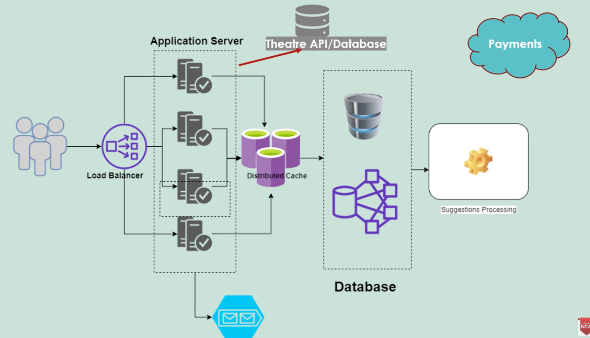

# ShowBooking

Goal:
To build an application to book show,

Basic:

The program must take input from cmd line
in-memory data (h2?)

| User Stories                                                |
| ---------------------------------------------------------- |
| Admin can set up seats, and the number of rows is customizable. |
| Admin cannot set up more than 10 seats per row.            |
| Admin cannot set up more than 26 rows.                     |
| Admin can view the list of shows.                          |
| Buyer can select one or more available seats.              |
| Buyer can buy tickets.                                     |
| Buyer can retrieve the list of available seats for a show. |
| Buyer can cancel tickets.                                  |
| Buyer can cancel seats within a configurable time window.  |
| Buyer can only make one booking per phone per show.        |

Advance:
- draw class diagram
- buyer can view the list of shows and timings
- each shows are tied to different cities (show the usage of RDBMs)
- buyer can make a booking that consist for different shows and timings
- when buyer buy the tickets, input payment options, sent to payment processor
- system should handle concurrency
- system should be secure (how to integrate spring security? )
  - there should be authentication and authorization for admin and buyer
- database should handle transactions as well as unstructured data
  (people posting comments, reviews, the movie, the rating)
- reviewers can post a comment or rate the movie?
- use kafka queue to send tickets to the phone number (simulate)
- dockerize it if possible to RHLM
- connect to mongo for the reviews

APIs
- getCities
- getTheatreByCity
- getMovieByTheatre
- getAuditoriumByMovie
- getShowbyAuditorium
- getAvailableSeatByShows
- bookSeat
- sendTicketByMailOrSMS
- postCommentAndReviews

Goal:
highly scalable
highly available (highly concurrent - load balancer have different techniques to balance the load. round robin, least connection based strat, etc)
fault tolerant system 

frontend caching system - varnish. relieve the structure on the overall backedn infrastructure
cache is very importnat to save all the information to movies
the sitting... in memory cache or redis!! distributed and persistent

app servers

nosql: comments, ratings, movie info. trailers gallery, artists, cast, reviews, analytics data

user made a request.. load balancer will distribute it to one of the application server
distributed cache (redis cache) 
all the details can be sort from the cache
the user data can be pulled from the cache 

timing to select the seats is important
application server has to make a requet to a queue...
this queue is for sending the tickets

so far, these are the components/concepts:
1. kafka (queuing system -> send it to the email and generate a QR)
2. java 8+ spring boot
3. spring security
4. mongoDB unstructured data
    - used to store the unstructured data such as ratings
    - user comment
    - reviews for a particular movie 
    - movie/theatre releasing some synopsis
    - put trailer
    - user session (supposed user visited the application and browse through the application and selected some theatre, then the data will be user has visited the theatre multiple times
    - a particular genre of movie this particular user is watching every now and then
    - put it through a suggestions processing system such as spark)
5. distributed cache?? (idk how)
6. relationalDB (oracle)
    - when we find an entity relationship
    - store a user db
    - movie db
    - the relationship between the movie and the theatre
    - store relationship between the booking
    - history of the booking and payment
7. concurrent java (system will put a lock to a particular seat so 2 users are not able to book the same seat)
  - if it's just 1 application server, we can handle it using synchronization 
    - but since there are multiple application servers, we can't use synchronization at application level
    - synchronization/blocker will take place at database level 
    - as soon as it gets the first request, it will send the request to theatre API and lock will be placed at db level row
    - seat id isolation level of the db (read committed, etc etc)
    - once that row is locked, no other users can select that row, it will return some error back to the applciation server
    - row is locked or not available, send back to the user
    - till the payment is done, the seat will be kept locked
    - if the payment is not finished within the time frame, and the payment request can be cancelled
    - that's how the concurrency be maintained
8. reactive programming for streams of data
9. swagger?
10. graphql (alternative REST)

take input from cmdline
set up available seats
allow buyers to select 1 or more available seats and buy/cancel tickets

